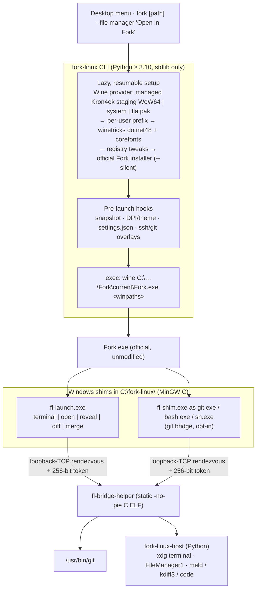

# Fork for Linux (unofficial) — AI Agent Workspace Guidelines

System-level guidelines, architectural principles, coding standards, and safety rules for AI coding agents working in the **Fork for Linux (unofficial)** codebase.

Related docs:

- [docs/INSTRUCTIONS.md](docs/INSTRUCTIONS.md) — setup, build, extend, debug (planned)
- [docs/architecture/README.md](docs/architecture/README.md) — component deep dive (planned)
- [docs/SECURITY.md](docs/SECURITY.md) — threat model and mitigations (planned)
- [docs/COMPATIBILITY.md](docs/COMPATIBILITY.md) — distro / desktop / Wine provider results, filled only from E2E evidence (planned)
- [docs/CREDITS.md](docs/CREDITS.md) — Fork developers, prior art, third-party components
- [docs/spikes/](docs/spikes/) — feasibility spike results and the decisions they gated
- [`.agents/skills/`](.agents/skills/) — focused runbooks (`SKILL.md` per workflow; index in [skills.md](skills.md)) (planned)

Thin tool adapters (do not duplicate this file): [CLAUDE.md](CLAUDE.md), [GEMINI.md](GEMINI.md), [`.github/copilot-instructions.md`](.github/copilot-instructions.md), [`.cursor/rules/fork-linux-agents.mdc`](.cursor/rules/fork-linux-agents.mdc). Legacy stubs: [agent.md](agent.md), [skills.md](skills.md).

---

## 1. Project DNA & Context

* **What is Fork for Linux (unofficial)?**
  A Linux-native, packaged wrapper that runs the **official, unmodified** [Fork](https://git-fork.com) git client for Windows under Wine. Fork is proprietary, paid software made by **Dan Pristupov and Tanya Pristupova**; its Windows build is .NET Framework 4.7.2 + WPF, x64 only. This project ships only our own code: a Python CLI (`fork-linux`, alias `fork`), small C shims, desktop integration and packages. Fork itself is downloaded from its official CDN on the user's machine at first run.
* **Unofficial status**: we are **not affiliated** with Fork's developers. They have no Linux port planned; Dan opened [fork-dev/Tracker#2033 "Run Fork with Wine"](https://github.com/fork-dev/Tracker/issues/2033) himself and suggested a community install script. The Linux request is [fork-dev/Tracker#153](https://github.com/fork-dev/Tracker/issues/153). Users still need a Fork license (https://git-fork.com/buy).
* **Naming**: product **"Fork for Linux (unofficial)"**, command **`fork-linux`** (plus the `fork` argv[0] alias), package **`fork-linux`**, app-id **`io.github.ventura8.ForkLinux`**. The single source for these strings is [`src/fork_linux/__init__.py`](src/fork_linux/__init__.py) (`APP_NAME`, `PACKAGE`, `APP_ID`).
* **Target OS**: the fixed baseline is **Ubuntu 26.04 (resolute)**; **Ubuntu 22.04 (jammy)** is the oldest supported release (PPA build + `jammy` compat cell). Also tested: Ubuntu 24.04 (noble), Debian 13, Fedora 44, openSUSE Leap 16.0, Arch Linux. Do not mix other codenames into docs or CI.
* **Architecture**: **x86_64 / amd64 only** (Fork for Windows is x64 only). Never add other architectures to packages or CI.
* **Language**: **Python 3.10, standard library only** for the CLI, the host helper and every test (pytest is the only test dependency). The bridge layer is **C11** (MinGW-w64 PE shims + a static Linux ELF helper).
* **Fork version**: **2.23.2** is the first known-good version (spike S3: installer sha256 `fee9b2bf…f079e`, 76,278,256 bytes). Known-good / known-bad versions live in `src/fork_linux/data/runtime-manifest.json`.
* **Wine**: the default provider is **managed** — the pinned Kron4ek `wine-11.0-staging-amd64-wow64` build (WoW64, no i386 multiarch). Also `system` (Wine ≥ 9.0), `flatpak` (`org.winehq.Wine` BaseApp) and `custom PATH`. Spike results: [docs/spikes/01-runtime-and-fork.md](docs/spikes/01-runtime-and-fork.md).
* **Core goal**: install, launch and update the official Fork safely and reversibly, credit its developers prominently, and leave nothing behind that we did not create.

> [!CAUTION]
> **HARD RULES (non-negotiable; enforced by tests and the lint stage where possible)**
>
> 1. **Never redistribute, mirror, cache-publish, patch, decompile or modify Fork binaries** (installer, `Fork.exe`, its DLLs, nupkgs) — not in the repository, packages, Docker images, CI caches or CI artifacts. No binary patching, no resource editing, no IL rewriting, no license or evaluation bypass of any kind.
> 2. **Download Fork only from `https://cdn.fork.dev/win/`**, on the user's machine. The installer URL is built locally from the manifest's `installer_url_template` and a strictly validated version string — never taken from a feed, a redirect target outside the allowlist, or a mirror.
> 3. **Only touch what is ours**: Wine config, the registry, environment variables, files **outside** Fork's install directory, and exactly two of Fork's **user data files** — `AppData\Local\Fork\settings.json` (JSON merge of known keys) and `AppData\Local\ForkData\repositories.toml` (only its top-level `source_dirs` line, edited line by line by `fork_data.py`) — each only while Fork is closed, backed up first, never through a symlink, with every unknown key and byte preserved. Never Fork's binaries. Fork's Velopack-managed `current\` folder is only ever snapshotted or restored as a whole (rollback) — its files are never edited. A user's own repositories are changed only by `fork-linux repo fix` or a confirmed `doctor --fix`, and `repo undo` reverts exactly that.
> 4. **No Fork logo, icon, screenshots or artwork in the repository**, docs, issue templates, packages or CI uploads. The menu icon is extracted from the user's own `Fork.exe` at runtime; the only icons we ship are our own neutral SVGs under `data/icons/`.
> 5. **Never touch `~/.wine` or any Wine prefix we did not create.** Our prefix is `~/.local/share/fork-linux/prefix/` and carries the marker `.fork-linux/created-by`; anything without that marker is refused, never modified or deleted.
> 6. **Always verify integrity**: every download is HTTPS with a pinned size + sha256 from the shipped manifest. Trust-on-first-use exists only behind an explicit `--latest` (HTTPS, `MZ` header + size sanity, then the installed full nupkg sha256 must equal the feed's `SHA256`).
> 7. **HTTPS host allowlist**: our downloader fetches only `https://` URLs on the manifest allowlist (`cdn.fork.dev` for the installer, `git-fork.com` / `fork.dev` for the update feeds, `github.com` + its release-asset hosts for Kron4ek Wine, `raw.githubusercontent.com` for the pinned winetricks). Redirects that leave the allowlist are refused. Winetricks' own downloads (Microsoft .NET, core fonts) are sha256-checked by winetricks.
> 8. **Per-user state only.** All Wine state lives in the user's XDG directories. Packages ship code only; **maintainer scripts never touch home directories and never run Wine** — and we ship no maintainer scripts at all (§4.9).
> 9. **Never run Wine or setup as root.** Preflight refuses root (`UNSUPPORTED_ENV`) unless the user explicitly passes `--allow-root`; packages, CI and E2E tests never run Wine as root (E2E uses an unprivileged test user).
> 10. **Trademark-safe naming**: always "Fork for Linux (unofficial)" in user-visible names; never present the project as official, never call our app just "Fork", never use Fork's logo or a look-alike.
> 11. **Credits and disclaimer stay intact**: the not-affiliated disclaimer, the developers' names and the buy link (https://git-fork.com/buy) appear in the README credits block, `docs/CREDITS.md`, `fork-linux about`, the setup consent dialog, the metainfo description and the `.desktop` comment. They come from `credits.py` (planned) and must never be removed, shortened into invisibility or contradicted. Wrapper bugs are reported to this repository, never to Fork support.
> 12. **winemenubuilder is always disabled** (`DllOverrides winemenubuilder.exe=""` in the prefix and `WINEDLLOVERRIDES` on every Wine call), so Wine never writes menu entries or MIME associations into the user's desktop.
> 13. **Fork's EULA is shown and accepted** (consent step or `--accept-fork-eula`) before anything is downloaded.
> 14. **No lint suppressions**: no `# noqa`, `# type: ignore`, `NOSONAR`, `# pragma: no cover`, `NOLINT*`, `#pragma GCC diagnostic ignored`, `# shellcheck disable`, `@pytest.mark.skip`/`xfail`, coverage `exclude_lines`/`omit`, ruff/flake8 `per-file-ignores`, `.shellcheckrc` `disable=`, actionlint `-ignore`, lintian overrides or rpmlint filters. Fix the code. Enforced by [`scripts/no-suppressions-lint.py`](scripts/no-suppressions-lint.py).
> 15. **No Python 3.11+ APIs**: no `tomllib`, `hashlib.file_digest`, `enum.StrEnum`, `datetime.UTC`, `ExceptionGroup` / `except*`, `typing.Self`, `contextlib.chdir`, `shutil.rmtree(onexc=)`, `Path.walk`, or `tarfile` `filter=` unless guarded by `hasattr` (`tests/test_repo_hygiene.py` detects most of them). Every module starts with `from __future__ import annotations`.
> 16. **Tests never touch the real home, network or Wine** unless explicitly gated (`FL_REAL_WINE=1`, `FL_E2E_FORK=1`). Use the `xdg` and `fake_bin` fixtures from `tests/conftest.py`.
> 17. **Never push, tag or publish** (GitHub, Launchpad PPA, Snap Store, AUR, Flathub) without an explicit request from the maintainer.

---

## 2. High-Level Architecture

AI agents must understand the relationships and communication channels between the project's components:

### Lifecycle notes (agents must preserve)

* **Lazy, resumable setup**: `fork`, `fork-linux run` and the desktop entry run any pending bootstrap steps first (zenity / kdialog progress, terminal fallback). Each step records a marker of (revision, inputs hash, verify result), so a failed setup resumes at the failed step. Setup, update, rollback and uninstall hold one `flock` at `$XDG_RUNTIME_DIR/fork-linux/setup.lock` (`LOCKED` on contention).
* **Bootstrap steps** (planned, `src/fork_linux/steps/`): preflight → consent → wine_runtime → winetricks → prefix_init (`WINEARCH=win64`, `WINEDLLOVERRIDES=mscoree,mshtml=` during wineboot) → shell folders (`Desktop` becomes a real directory so `Fork.lnk` never lands on the Linux desktop) → registry batch → dotnet (`dotnet48` then `dotnet472`; verify `NDP\v4\Full\Release ≥ 461808`) → winver → fonts → font replacements → DPI → Fork download / `--silent` install / nupkg-vs-feed verify → fork_settings (settings.json + `repositories.toml` `source_dirs`) → shims → host_integration (`App Paths\explorer.exe` → `fork-linux-explorer`, `ForkLinux.File` open association via winebrowser, `H:` drive → `$HOME`) → git_overlay (translated host config + `url.*.insteadOf` rewrites for `/home`, `/mnt`, … + `credential.credentialStore=dpapi`) → ssh_sync → icon → desktop entry → finalize. Every Wine call uses `WINEDEBUG=-all` (or a rotating `wine-<ts>.log` with `--debug`).
* **Exec model**: the launcher resolves paths, converts them with `pathmap` (dosdevices longest prefix, no `winepath` call) and replaces itself with Wine (`os.execve`), under 300 ms when nothing changed. When Fork already runs in our prefix, Fork's own single-instance pipe forwards the paths (spike S7). The environment sets `WINEPREFIX`, the pinned `WINESERVER`/`WINELOADER`, `WINEHOME=C:\users\<u>` (spike S5), and `GIT_CONFIG_COUNT/KEY/VALUE` with `core.filemode=false`, `core.autocrlf=false`, `core.symlinks=true` (spike S6). `worktree.useRelativePaths=true` is added only when the host `git --version` is ≥ 2.48 (probe cached in `$XDG_CACHE_HOME/fork-linux/host-git-version.json`). When the git bridge runs native git, the bundled-git-only keys (`core.filemode`, `core.autocrlf`, `core.symlinks`; `gitconfig.BUNDLED_ONLY_KEYS`) are left out so native git sees real modes. Before exec (Fork closed) the previous `fork.log` is copied to `<logs>/fork-<UTC mtime>.log` (newest 10 kept). `pathmap` never picks the alias drive `H:` for Linux→Windows conversion, so Fork keeps seeing repositories under `Z:`.
* **Display scaling**: Wine's `LogPixels` alone (step `display_dpi`); fork-linux never writes Fork's `LayoutScaling` (both together scaled the UI twice, QA 1.4). The `fork_settings` step (rev 2) resets a `LayoutScaling` that still holds the value older builds wrote back to 100.
* **Host actions without the bridge**: Wine can start a Unix `#!/bin/sh` script directly (spike B1) but its children inherit staging's seccomp + `NoNewPrivs=1`, so `libexec/fork-linux-{terminal,explorer,open-url}` hand the work to `fork-linux-handoff`, which runs `fork-linux-host` in a transient `systemd-run --user` unit (`NoNewPrivs=0`; fallback: direct). Fork's `ShellTool` points at `fork-linux-terminal`; `fl-launch.exe` is used for ShellTool / ExternalDiffTool / MergeTool (plus one `Linux (fork-linux)` entry in Fork 2.23's `ExternalDiffTools` / `ExternalMergeTools` lists, which is what makes "Diff in …" / Ctrl+D appear) only when `bridge.host_actions_active()` (during a launch: the daemon really started; elsewhere: `bridge.check().ready`), and a dead `fl-launch.exe` setting or list entry is reset (user entries are kept).
* **Update safety**: Fork updates itself through Velopack, which replaces `current\`. Before each launch we take a hardlink-clone snapshot of `current\` + `settings.json` + `custom-commands.json` + `ForkData` (keep 2; `accounts.json` is never snapshotted). `rollback` swaps the directory back, deletes newer staged nupkgs and pins `update_policy=pinned`. A Wine runtime upgrade re-runs only the Wine-dependent steps and keeps the previous build for revert.
* **Bridge transport (launcher-started daemon)**: Wine starts non-PE images without a usable process handle or exit code, and every Linux process a wine-staging process spawns inherits its seccomp + `NoNewPrivs` (spike B2), so nothing Linux-side is started through Wine. With `[git] bridge=on` the launcher (`bridge.start_daemon`, main thread, after `ensure_ready` and before the pre-launch hooks) writes a 256-bit token to a fresh `0600` file (`O_EXCL|O_NOFOLLOW`) in the `0700` `$XDG_RUNTIME_DIR/fork-linux`, starts `fl-bridge-helper --daemon --token-file … --parent-pid <launcher pid> --host-helper … --log <logs>/bridge-<UTC>.log` with a Unix-clean environment, reads its single `FL_BRIDGE_PORT=<n>` line (5 s), exports `FORKGITINSTANCE=C:\fork-linux\gitInstance`, `FL_BRIDGE_PORT/TOKEN/WINEXEC/ASKPASS/SSH_ASKPASS`, `FL_WINE`, `WINEPREFIX`, records `{pid, port, env}` in `session.json` (0600) and execs Wine: the exec keeps the pid and main thread, so the daemon's `--parent-pid` and `PDEATHSIG` follow the Wine process running Fork (verified: it exits ~1 s after Fork). A second `fork` while Fork runs reuses that daemon's variables from `session.json`; any start failure is a warning and Fork uses bundled git. The PE shims (`git.exe`/`bash.exe`/`sh.exe` = `fl-shim.exe` under `C:\fork-linux\gitInstance`, `fl-launch.exe` in `C:\fork-linux\bin`, installed by step `host_shims`) connect to `127.0.0.1:<port>`, authenticate both ways (HMAC over the token, which travels only in the environment block, never argv), and framed full-duplex messages carry stdin/stdout/stderr/exit; the daemon forks a session per connection, its child gets `PDEATHSIG`, socket EOF triggers `killpg` TERM → KILL after 3 s. Spec: [bridge/README.md](bridge/README.md).
* **Git bridge is opt-in and reversible**: `fork-linux git-bridge enable` (needs host git ≥ 2.40, warns below 2.50; in a source checkout offers `scripts/build-bridge.sh`) only sets `[git] bridge=on`; `git-bridge record on|off` sets `[git] bridge_mode` (shims forward to Fork's bundled git); `git-bridge disable` goes back. Only the tool settings above follow the bridge in `settings.json`; bundled git stays the default.
* **Desktop integration**: our `.desktop` file uses `StartupWMClass=fork.exe` (spike S4). The extracted icon goes to `~/.local/share/icons/hicolor/<N>/apps/io.github.ventura8.ForkLinux.png`, shadowing our neutral placeholder. Only files recorded in `integrations.json` and still unmodified are ever removed.

### Runtime paths (XDG)

| What | Location |
|---|---|
| Config | `~/.config/fork-linux/config.ini` |
| Prefix (mode 0700) | `~/.local/share/fork-linux/prefix/`; state in `<prefix>/.fork-linux/state.json`; marker `<prefix>/.fork-linux/created-by` |
| Managed runtimes | `~/.local/share/fork-linux/runtimes/{wine,winetricks}/<id>/` (`.complete` marker holds the sha256) |
| Snapshots | `~/.local/share/fork-linux/snapshots/` |
| Integration registry | `~/.local/share/fork-linux/integrations.json` |
| Downloads + feed cache | `~/.cache/fork-linux/` |
| Logs | `~/.local/state/fork-linux/logs/` (rotating) |
| Lock | `$XDG_RUNTIME_DIR/fork-linux/setup.lock` (`flock`) |

---

## 3. Directory Layout Reference

v0.1.0 is built in phases; rows marked **(planned)** do not exist yet. When you add one, drop the marker in the same change (§4.7).

| Path | Purpose / Description |
|---|---|
| `AGENTS.md` | Agent workspace guidelines (this file, canonical). |
| `CLAUDE.md`, `GEMINI.md`, `.github/copilot-instructions.md`, `.cursor/rules/fork-linux-agents.mdc` | Thin tool adapters pointing here. `agent.md`, `skills.md`: legacy stubs (skills index). |
| `VERSION` | **Single source of truth** for the project semver (`N.N.N`, currently `0.1.0`). See §4.7.2. |
| `README.md`, `LICENSE` | User docs (credits block between `<!-- credits:begin -->` / `<!-- credits:end -->`); MIT license for this repository only. |
| `pyproject.toml` | **Tool configuration only** (pytest, coverage). No `[build-system]`, no `[project]`: we are not a pip package. |
| `meson.build`, `meson.options`, `meson_options.txt` → `meson.options` | Meson build (present: builds the bridge only — options `bridge` (feature) and `tests`); installing the Python package, launchers and data is planned. |
| `install.sh`, `uninstall.sh` | curl\|bash per-user installer and manifest-based uninstaller; whole body inside `main()` (planned). |
| `.clang-tidy` | clang-tidy config for `bridge/` (planned). |
| `.agents/skills/<name>/SKILL.md` | Focused runbooks (planned; index in `skills.md`). |
| `bin/` | `fork-linux.in` relocatable launcher (`#!@PYTHON@ -I`; finds `share/fork-linux` or, in a checkout, `src/`; `FORK_LINUX_LIBDIR` overrides) — present. The `fork` symlink (argv[0] dispatch) is created at install time (planned with the Meson install rules). |
| `libexec/` | `fork-linux-host.in` — Python host helper (thin wrapper around `fork_linux.host_helper`: terminal / reveal / open / diff / merge / edit); `fork-linux-open-url` — POSIX sh URL opener used as Wine's winebrowser target. |
| `src/fork_linux/` | The Python package, one concern per module: `__init__` (names), `__main__`, `errors` (exit codes + exceptions, §5), `versions`, `version` (our own version: `_build.py` or `VERSION`), `resources` (installed vs source-checkout file lookup), `cli` (global options, `AppContext`), `fork_cli` (`fork [PATH]` → `run`), `commands/*` (one module per subcommand: `setup`, `run` (+`open`), `update`, `snapshot` (+`rollback`), `settings`, `desktop`, `ssh`, `gitbridge` (`git-bridge`), `repo` (check/fix/undo repository settings), `logs`, `doctor`, `uninstall`, `status`, `version`, `about` (+`credits`), `config`; listed in `commands/__init__.py` `COMMANDS`), `paths`, `sandbox`, `config`, `config_edit`, `state`, `fsutil`, `locking`, `procrun`, `logging_setup`, `manifest`, `download`, `feeds`, `hostdeps`, `wine_provider`, `winecmd`, `registry`, `winetricks`, `bootstrap` (resumable step runner), `steps/*` (`preflight`, `consent`, `runtime`, `prefix`, `dotnet`, `fonts`, `display`, `fork`, `integration`, `finalize`), `fork_layout`, `fork_install`, `fork_settings`, `fork_data` (ForkData `repositories.toml`), `fork_tools` (ShellTool / diff / merge targets), `repos` (repository scan + opt-in fixes), `pathmap`, `procs`, `launcher`, `snapshots`, `updates`, `doctor`, `display`, `theme`, `ui`, `pe_resources`, `imaging`, `icon_extract` (Fork.exe icon → hicolor PNGs at runtime), `desktop_integration`, `ssh_sync`, `gitconfig`, `bridge`, `host_helper`, `credits`. Tests: `tests/test_<module>.py`, `tests/test_cmd_<command>.py`, `tests/test_steps_<step>.py`. |
| `src/fork_linux/data/` | `runtime-manifest.json` (pinned Wine / winetricks / Fork versions, sizes, sha256), `defaults.ini`, `templates/*.in` (menu entry, Nautilus extension + script, Nemo, Dolphin, Thunar, FMA actions) — present; `icons/placeholder.svg` (planned). `src/fork_linux/_build.py` is generated by Meson and gitignored. |
| `bridge/` | C bridge: `common/` (pure C `fl_proto`, `fl_sha256`, `fl_shquote`, `fl_translate` — natively unit-tested), `win/` (`fl_shim.c`, `fl_launch.c`, `fl_win.c`, `res/*.rc`, `res/app.manifest`, `tests/fl_testdrv.c`), `unix/` (`fl_bridge_helper.c`, `fl_helper_util.c` → `fl-bridge-helper` + `fl-winexec` / `fl-askpass` / `fl-ssh-askpass` personas), `tests/` (`unit/` native TAP tests + `run.sh`, `vectors/*.tsv`, `testdriver/fl-testdriver.c`, test only), `spike/` (Phase 0 bridge probes); `meson.build`. All present. |
| `data/` | `io.github.ventura8.ForkLinux.{desktop.in,metainfo.xml}`, `icons/hicolor/` (**our** neutral SVGs only), `man/{fork-linux,fork}.1`, `completions/{bash,zsh,fish}` (icons present; rest planned). |
| `packaging/` | `common/find-python.sh`, `arch/PKGBUILD.in`, `rpm/{fedora,opensuse}/fork-linux.spec`, `snap/{snapcraft.yaml,fork-linux-wrapper.sh,SNAPCRAFT_REVISION}`, `flatpak/io.github.ventura8.ForkLinux.yml`, `appimage/{build-appimage.sh,AppRun}` (planned). |
| `debian/` | `control`, `rules`, `changelog`, `copyright` (DEP-5), `source/{format,options}` — `3.0 (native)`, no maintainer scripts (planned). Build trees are gitignored. |
| `docker/` | CI, packaging and E2E Dockerfiles (§4.8; `Dockerfile.ci.jammy` and `Dockerfile.ci.bridge` exist, the rest are planned). Keep new Docker assets here — never at the root. |
| `scripts/` | `read-version.py`, `no-suppressions-lint.py`, `render-banner.sh` (`docs/assets/banner.svg` → `.github/banner.png`), `spike/*.sh`, `build-bridge.sh` (meson build + unit tests of the bridge in `fork-linux-ci-bridge`), `qa/fl-qa.sh` (isolated manual-QA / E2E driver) (present); `release-common.sh`, `release-{deb,rpm,arch,portable}.sh`, `aur-render.sh`, `ppa-docker.sh`, `release-verify-tag-version.sh`, `packaging-smoke-verify.sh`, `packaging-e2e-install.sh`, `ci-{docker,matrix,pipeline,packaging-cell,packaging-matrix,snap-build,e2e-wine}.sh`, `check-upstream-fork.py`, `check-dep-names.py`, `manifest-add-fork.py`, `gen-credits.py`, `generate-badges.py` (planned). |
| `tests/` | pytest only: `test_<module>.py` unit + contract tests, `conftest.py` (`xdg`, `fake_bin` fixtures), `fakes/bin/*` (fake wine / wineserver / winetricks / zenity / kdialog / terminals / desktop tools …), `fakes/bridge/fl-bridge-helper` (fake bridge daemon for the Python tests), `fixtures/` (`pe_builder.py`, `http_server.py`, `cli_run.py`, `fork_tree.py`, `setup_ctx.py`, `bridge_kit.py`, `.reg`, feeds), `bridge/` (daemon protocol tests; `test_shims_wine.py`, `test_launcher_wine.py` (+ `launcher_child.py`) and `wine/` need `FL_REAL_WINE=1`), `e2e/` (`FL_E2E_FORK=1`; results in `e2e/RESULTS.md`). |
| `docs/` | `CREDITS.md`, `spikes/NN-*.md`, `assets/banner.svg` (present); `INSTRUCTIONS.md`, `architecture/README.md`, `SECURITY.md`, `COMPATIBILITY.md`, `releases/vX.Y.Z{,_github_description}.md`, `badges/` (planned). |
| `logs/` | Agent progress + local CI tee output (`*.log` gitignored; see [logs/README.md](logs/README.md)). |
| `.github/` | `ISSUE_TEMPLATE/*.yml`, `pull_request_template.md`, `FUNDING.yml`, `actionlint.yaml`, `copilot-instructions.md`, `banner.png` (present); `workflows/{check,release,e2e-wine,upstream-watch}.yml` (planned). |
| `artifacts/` | Gitignored release/packaging output (`.deb`, `.rpm`, `.pkg.tar.zst`, `.snap`, `.AppImage`, `.flatpak`, tarball, `SHA256SUMS`). Local staging `build-*/`, `builddir*/`, `obj-*/` is gitignored too. |

---

## 4. AI Coding Standards & Rules

### 4.1 Python Implementation Guidelines

* Target **Python 3.10**, **standard library only** (runtime, scripts and tests; pytest + pytest-cov are the only test tools). Hard rule 15 lists the forbidden 3.11+ APIs; CI runs the suite on Ubuntu 22.04's Python 3.10 (`fork-linux-ci-jammy:22.04`).
* Every module: `from __future__ import annotations`, 4-space indentation, type hints on public functions, a short docstring per module/class/function. PEP 8 layout.
* One concern per module (§3). Keep imports acyclic; the CLI router imports command modules lazily so `fork <path>` stays fast.
* Errors: raise the `errors.py` exceptions (`ForkLinuxError(message, hint=...)` and subclasses); the CLI maps them to §5 exit codes and prints the hint. Never `sys.exit()` from library code.
* Subprocesses: argument lists only — **never `shell=True`** or string commands. Go through `procrun` (timeouts, env sanitising, logging with secret redaction).
* Filesystem: write through `fsutil.atomic_write` (temp file + `fsync` + `rename`), delete only through `fsutil.safe_rmtree` inside our own directories, extract archives only through `fsutil.safe_extract`. Resolve every location through `paths.py`; never hard-code `~`.
* Output: human text by default, `--json` for machine output (versioned schema, e.g. `doctor` schema 1). Logging through `logging_setup`, which redacts tokens, passwords and URLs with credentials.
* Launchers run `python3 -I` (isolated mode) so a planted module in the cwd can never be imported.
* Tests: `tests/test_<module>.py`, pytest only, using the `xdg` fixture (fake `HOME` + XDG dirs) and `fake_bin` (fakes first on `PATH`, calls logged to `$FL_FAKE_LOG`). No network (use a local fake HTTP server), no real Wine, no real home. Runtime `pytest.skip()` is allowed for genuinely unavailable tools; skip/xfail markers are not.

### 4.2 C Bridge Guidelines

* **C11** (`-std=c11`), `-Wall -Wextra -Werror`, clang-tidy clean against `.clang-tidy` (`WarningsAsErrors`).
* **Windows PEs** (MinGW-w64): wide-character entry points (`wmain` / `wWinMain`) built with **`-municode`**; `-O2 -static -static-libgcc -s -Wl,--no-insert-timestamp,--build-id=none -lws2_32 -lbcrypt`; `_dowildcard = 0` so pathspecs are never globbed. Never `system()`, `_wsystem()`, `popen()` or `ShellExecute*` on built strings: spawn with `CreateProcessW` and a command line produced by the shared argv-quoting code.
* **Linux helper**: `musl-gcc` (fallback `gcc -static`) with **`-static -no-pie`** — Wine misclassifies static-pie (ET_DYN) images, so the helper must be ET_EXEC. Spawn with `posix_spawn` / `execve` and argv arrays only; never `system()`.
* **Secrets**: the 256-bit token comes from `BCryptGenRandom`, travels in the environment block (never argv), and is compared in constant time. Sockets bind `127.0.0.1` only, with `TCP_NODELAY`.
* Pure logic (path translation, argv tables, framing, shell quoting) lives in `bridge/common/` and is unit-tested natively under ASan/UBSan against `bridge/tests/vectors/*.tsv`.
* Always close handles / file descriptors and free allocations on every path, including errors.
* **Reproducible builds**: honour `SOURCE_DATE_EPOCH`; CI builds twice and compares sha256; `git-bridge status` checks shims against the shipped sha manifest.

### 4.3 Security & Integrity Rules

> [!CAUTION]
> Fork for Linux downloads and executes third-party code (Wine, winetricks, Microsoft .NET, Fork) in the user's account. Integrity and containment are paramount. **Wine is not a sandbox**: a Windows program in the prefix can read the user's files via `Z:`.

* **Downloads**: HTTPS only, host allowlist (hard rule 7), pinned size + sha256, retries with resume, verification **before** the file is moved into place or executed. A failed check raises `IntegrityFailed` (exit 13) and deletes the partial file.
* **Feeds are untrusted input**: versions are strictly validated (`versions.is_valid`), URLs are never taken from a feed, and feed hashes are only used for the post-install TOFU check.
* **Archives**: `safe_extract` rejects absolute paths, `..`, symlinks / hardlinks escaping the target, device files and oversized members.
* **Filesystem**: the prefix and our state directories are `0700`; refuse to operate on paths without our marker; open sensitive files with `O_NOFOLLOW` where symlink swaps matter; never follow symlinks out of our tree when deleting.
* **Never shell strings** — Python argument lists, C argv arrays (§4.1, §4.2).
* **Secrets**: SSH private keys are linked or copied `0600` into a `0700` directory, never logged; `accounts.json` is never snapshotted and never included in `logs --bundle`; log redaction covers tokens and credentialed URLs.
* **Sandboxed packages**: inside Snap / Flatpak / AppImage the CLI strips the sandbox environment before spawning Wine or host tools.
* **Locking**: one `flock` for setup / update / rollback / uninstall; never run two bootstraps on one prefix.
* **winemenubuilder disabled** everywhere (hard rule 12); Fork's `Folder\shell\{open,explore}` handlers are redirected to `fl-launch.exe open "%1"`.
* Threat model details and their verification live in [docs/SECURITY.md](docs/SECURITY.md) (planned).

### 4.4 Legal & Branding Rules

> [!WARNING]
> This project exists by the goodwill of Fork's developers. Breaking these rules can get the project taken down.

* We wrap, we do not modify: no patching, decompiling, disassembling, resource editing or redistribution of Fork (hard rules 1–3). Fork's license forbids reverse engineering.
* Show Fork's EULA (https://git-fork.com/license) and get consent before the first download (hard rule 13). Never automate license activation, never bypass or extend the evaluation.
* Always carry the **not-affiliated disclaimer** and a **buy link** (https://git-fork.com/buy) wherever the product is described: README, `docs/CREDITS.md`, `fork-linux about`, consent dialog, metainfo, `.desktop` comment, package descriptions, release notes. `credits.py` is the single source; `scripts/gen-credits.py` regenerates the README block and `test_credits.py` fails on drift (planned).
* User-visible names always include **"(unofficial)"**; descriptions say "Unofficial Wine wrapper for the Fork git client". "Fork" and its logo belong to their owners.
* No Fork artwork or screenshots anywhere we publish (hard rule 4). Documentation screenshots, if ever needed, show only our own UI (e.g. the setup dialog).
* Route bug reports correctly: wrapper / Wine / Linux issues → this repository; problems that also happen on Windows → [fork-dev/TrackerWin](https://github.com/fork-dev/TrackerWin). Never tell users to contact `support@fork.dev` except about licensing.
* Third-party terms: Microsoft .NET Framework and the core fonts are installed by winetricks under Microsoft's own terms; say so in the consent dialog and the README. Each new prefix may use one of the license's 3 machine activations — warn before `uninstall --purge`.
* Courtesy: before any public launch the maintainer contacts Fork's developers; agents never contact them or post in their trackers.

### 4.5 Lint and Test New or Changed Files (Mandatory)

> [!IMPORTANT]
> New or modified executable code must pass the same quality gates as the rest of the repo before the work is complete.

* **When adding or changing files**, run the applicable linters and tests in the **same change set** — do not defer lint/test fixes to CI or a follow-up.
* **By file type**:
  - **Python** (`*.py`, `*.in` Python launchers): `python3 -m py_compile` on touched files; `python3 -m pytest -q tests/test_<module>.py --cov=fork_linux.<module> --cov-branch --cov-report=term-missing`; also run on Python 3.10 (`docker run --rm -v "$PWD":/src -w /src fork-linux-ci-jammy:22.04 python3 -m pytest -q -p no:cacheprovider tests/test_<module>.py`).
  - **Coverage gates**: 90% overall; **100% branch** on `download`, `manifest`, `feeds`, `fsutil`, `locking`, `state`, `config_edit`, `registry`, `pathmap`, `fork_settings`, `snapshots`, `bootstrap`, `pe_resources`, `imaging`, `ssh_sync`, `gitconfig`, `errors`.
  - **Shell** (`*.sh`, `install.sh`, `uninstall.sh`, packaging hooks): `bash -n` + `shellcheck` (no `-e`, no disable directives).
  - **Completions**: `bash -n`, `zsh -n`, `fish -n` on `data/completions/*`.
  - **C** (`bridge/**`): `meson setup` + `meson compile` with `-Werror`, `meson test` (native vectors under ASan/UBSan), clang-tidy (lint stage).
  - **Meson files**: `meson setup` + `meson compile` + `meson test` still succeed; `DESTDIR` install smoke when install rules change.
  - **Workflows** (`.github/workflows/*.yml`): `actionlint` (runner labels in `.github/actionlint.yaml`).
  - **Desktop entry**: `desktop-file-validate` on the generated `.desktop`.
  - **AppStream**: `appstreamcli validate --no-net` on the metainfo.
  - **Everything** (production, tests, build, packaging): `python3 scripts/no-suppressions-lint.py .` — also run by `tests/test_no_suppressions_lint.py::test_repo_has_no_suppressions`.
* **New test files**: `tests/test_<module>.py`; contract tests (version, workflows, docker pins, credits, repo hygiene) live beside them.
* **Run order**: targeted checks first (one test file, one `py_compile`, one meson test), then the broader gates for shared infrastructure (`FL_CI_STAGE=lint ./scripts/ci-docker.sh`, `FL_CI_STAGE=coverage ./scripts/ci-docker.sh`, `./scripts/ci-pipeline.sh` — planned).
* **Exceptions**: pure docs, release notes or agent-only markdown with no executable code — lint/test not required.

### 4.6 Progress Visibility

* Always show what you are doing: print progress to the terminal, or append timestamped lines under `logs/` at the repo root (e.g. `logs/agent-progress.log`).
* Prefer `tee -a` so the same line reaches both the terminal and the log.
* Create `logs/` if missing. Do not leave long agent runs silent. Do **not** use other log roots for agent progress.
* See [logs/README.md](logs/README.md).

### 4.7 Always Update Agent Docs

* **Whenever you change project files** (code, docs, config, tests, packaging, CI), update the relevant agent guidance in the **same change set** so the next session has accurate context:
  - [`AGENTS.md`](AGENTS.md) (this file — canonical)
  - [`.agents/skills/*/SKILL.md`](.agents/skills/) and the [skills.md](skills.md) index (planned)
  - [`docs/INSTRUCTIONS.md`](docs/INSTRUCTIONS.md), [`docs/architecture/README.md`](docs/architecture/README.md), [`docs/SECURITY.md`](docs/SECURITY.md) (planned)
  - Thin adapters if links or paths change: `CLAUDE.md`, `GEMINI.md`, `.github/copilot-instructions.md`, `.cursor/rules/fork-linux-agents.mdc`
* Keep one canonical body here; adapters stay short pointers (no divergent rule copies).
* Drop the **(planned)** marker in §3 when you create the file it describes.
* CI / Docker / matrix rules (§4.8) are mandatory agent constraints: if you change images, scripts or cells, update **both** this file and the affected skills (especially `ci-docker-matrix`) in the same change.

### 4.7.1 Keep the Repository Root Clean (Mandatory)

> [!IMPORTANT]
> Do **not** pile new top-level files at the repo root. Use the existing folders (`src/`, `bin/`, `libexec/`, `bridge/`, `data/`, `packaging/`, `debian/`, `docker/`, `scripts/`, `tests/`, `docs/`, `logs/`, `.agents/`, `.github/`).

* **Allowed root files** (complete list): `VERSION`, `meson.build`, `meson.options`, `meson_options.txt` (symlink → `meson.options`), `install.sh`, `uninstall.sh`, `pyproject.toml` (tool config only), `.clang-tidy`, `sonar-project.properties` (the scanner only reads it from the root), `AGENTS.md`, `CLAUDE.md`, `GEMINI.md`, `agent.md`, `skills.md`, `README.md`, `LICENSE`, `.gitignore`, `.dockerignore`.
* **Docker assets** live under `docker/`; **scripts** under `scripts/`; **workflows** under `.github/workflows/`; **agent runbooks** under `.agents/skills/`.
* When relocating or introducing paths: update agent docs first, then move/add files, then fix every script / workflow reference in the same change set. Leave no stale root copies.

### 4.7.2 Project Version — Single Source of Truth (Mandatory)

* The **only** version pin is the repo-root **`VERSION`** file (one `N.N.N` line).
* Read it via **`scripts/read-version.py`** (or by opening `VERSION`). Meson, `PKGBUILD.in`, the RPM specs (`-D fl_version`), the snap / flatpak manifests and tests must **not** hard-code a duplicate version.
* `fork-linux --version` prints `VERSION`; `tests/test_version.py` checks the file is semver and that `read-version.py` agrees.
* Bumping a release = write the new number to `VERSION`, add a `debian/changelog` top entry and a metainfo `<release>`, and write `docs/releases/vX.Y.Z.md` + `vX.Y.Z_github_description.md`. Contract tests check they agree. Do **not** hunt-and-replace version literals.
* The release tag `vX.Y.Z` must equal `VERSION` (`scripts/release-verify-tag-version.sh`, first job of `release.yml`).
* Fork's version (2.23.2) and the Wine / winetricks pins are **not** our version — they live in the runtime manifest and are bumped with the `fork-version-bump` / `wine-runtime-bump` skills.

### 4.8 CI / Docker Matrix (Mandatory)

> [!IMPORTANT]
> Pinned images, split stages and parallel per-distro cells are hard rules for agents touching Docker or CI.

* **Pinned everything** — explicit version tags only, **never `latest`**, never floating aliases, never commit SHAs:
  - Docker bases: `ubuntu:26.04` (baseline), `ubuntu:22.04` (jammy), `ubuntu:24.04` (noble), `debian:13`, `fedora:44`, `opensuse/leap:16.0`, a dated `archlinux:base-YYYYMMDD.0.N` tag. BuildKit frontend `# syntax=docker/dockerfile:1.27.0`.
  - GHA runners: `runs-on: ubuntu-26.04` (declared in `.github/actionlint.yaml`). GHA actions pinned to explicit tags (e.g. `actions/checkout@v7.0.1`).
  - Pip in CI images: exact `==` pins. Apt / dnf / zypper / pacman packages are locked by the pinned base image; no unpinned `curl | bash` installers.
* **Image tags** carry an explicit version suffix: `fork-linux-ci-<stage-or-cell>:<distro-version>` (present: `fork-linux-ci-jammy:22.04`, `fork-linux-ci-bridge:26.04`). Never rely on Docker's implicit `:latest`.
* **Dockerfiles under `docker/`**, one per stage / cell — never one ARG-switched Dockerfile for several distros.
* **Stages** (`FL_CI_STAGE`, run by `scripts/ci-docker.sh`, planned):

| Stage | Dockerfile | What it runs |
|---|---|---|
| `lint` | `docker/Dockerfile.ci.lint` (planned) | shellcheck on discovered files, actionlint, `py_compile`, `no-suppressions-lint.py`, desktop-file-validate, appstreamcli, `bash -n` / `zsh -n` / `fish -n` on completions, meson `-Werror` build, clang-tidy on `bridge/` |
| `coverage` | `docker/Dockerfile.ci.coverage` (planned) | pytest with the coverage gates of §4.5 |
| `bridge` | `docker/Dockerfile.ci.bridge` | MinGW + musl builds; `FL_REAL_WINE=1` Wine-tier suite with the testdriver |
| `compat` | one per cell (below) | meson build + `py_compile` + pytest (no coverage floors) + meson test |
| `packaging` | per format (below) | `scripts/ci-packaging-cell.sh <format>`: build + smoke verify + live install E2E |

* **Compat cells** (×7, all in parallel): `jammy` (`docker/Dockerfile.ci.jammy`, `ubuntu:22.04`), `noble` (`Dockerfile.ci.noble`), `resolute` (`Dockerfile.ci`, baseline `ubuntu:26.04`), `debian13` (`Dockerfile.ci.debian13`), `fedora44` (`Dockerfile.ci.fedora44`), `leap16` (`Dockerfile.ci.leap16`), `arch` (`Dockerfile.ci.arch`). Only `jammy` exists so far.
* **Packaging formats** (×9, all in parallel): `deb`, `deb-jammy`, `rpm-fedora`, `rpm-opensuse`, `arch`, `snap`, `appimage`, `flatpak`, `tarball` (Dockerfiles `Dockerfile.ppa{,.jammy}`, `Dockerfile.rpm.{fedora,opensuse}`, `Dockerfile.arch`, `Dockerfile.release`, `Dockerfile.snap` — planned).
* **GHA `check.yml`** (planned): triggers `push` to `main`, `pull_request`, `workflow_dispatch`; `concurrency` with `cancel-in-progress`; **no `needs:` gates** (every job starts at once); `strategy.fail-fast: false`; jobs `lint`, `coverage`, `bridge`, `compat` ×7, `packaging` ×9. **Fork-PR guard**: the packaging matrix (and anything needing secrets) runs only when `github.event_name != 'pull_request' || github.event.pull_request.head.repo.full_name == github.repository`.
* **Other workflows** (planned): `release.yml` (on `v*` tags + `dry_run` dispatch: verify tag == VERSION → PPA upload jammy/noble/resolute → 9 packaging cells → GitHub Release with `SHA256SUMS(.asc)`), `e2e-wine.yml` (weekly + dispatch + release-branch PRs: real setup under Xvfb; uploads **logs only** — no screenshots, no binaries, the Fork installer is never cached), `upstream-watch.yml` (weekly: detect a new Fork version, run E2E, open a bot PR or an issue).
* **Local runners** (planned): `./scripts/ci-pipeline.sh` (fail-fast lint → coverage → bridge → compat → packaging), `./scripts/ci-matrix.sh` (parallel compat), `./scripts/ci-packaging-matrix.sh` (parallel packaging), `./scripts/ci-e2e-wine.sh`. Tee output under `logs/` (see [logs/README.md](logs/README.md)).
* **Fix until green**: when running the gate, fix every failure and re-run until every stage and cell is green. Never ignore warnings, add suppressions, disable checks, raise thresholds, lower coverage floors or skip steps. Each stage keeps `set -euo pipefail` and warnings-as-errors.
* **Packaging log scan**: after any packaging cell, **read** `logs/ci-packaging/<format>.log` for every format — exit 0 is not enough. Fix meaningful `ERROR` / `WARNING` / `error:` lines that indicate broken product behaviour and re-run the affected cells.

* **SonarQube Cloud** (project `ventura8_Fork-Linux`, org `ventura8`), same model as Ubuntu-Hello:
  - Settings: `sonar-project.properties` (root). Python coverage from `artifacts/coverage/coverage.xml` (Cobertura, written by the coverage stage); C bridge analysed from the native meson compile database `build-sonar/compile_commands.json`.
  - Local: `./scripts/ci-sonar.sh` (pinned `sonarsource/sonar-scanner-cli:12.2.0.4256_8.1.0` in Docker; `FL_SONAR_COVERAGE=1` refreshes coverage first; `--check-token` only validates). Token from `SONAR_TOKEN` or the gitignored `.sonar-token`.
  - CI: a **step inside the `coverage` job** (not its own job): `fetch-depth: 0`, `./scripts/ci-sonar.sh --check-token`, then `SonarSource/sonarqube-scan-action@v8.2.2` with the `SONAR_TOKEN` secret, skipped on fork PRs.
  - Never `NOSONAR`. Rule ignores only as `sonar.issue.ignore.multicriteria` entries scoped to one rule **and** one path, each with a reason comment.

### 4.9 Packaging Rules (Mandatory)

* **No maintainer scripts**: no Debian `postinst` / `prerm` / `postrm` / `preinst`, no RPM `%pre` / `%post` / `%preun` / `%postun` scriptlets, no snap install hooks that touch homes, no AppImage auto-installers. Packages ship code; all Wine state is created per user at first run (hard rule 8).
* **App-id single source**: `io.github.ventura8.ForkLinux` (`APP_ID`) names the desktop file, metainfo, icons and Flatpak id; the package / snap / AUR name is `fork-linux` (`PACKAGE`). Templates read them at build time — never retype them.
* **amd64 / x86_64 only**: `Architecture: amd64`, `ExclusiveArch: x86_64`, `arch=('x86_64')`, Flatpak `x86_64`, snap `amd64`.
* **Never depend on the distro `wine` package** (not Depends / Requires / Recommends): the managed runtime is downloaded per user, the Flatpak uses the `org.winehq.Wine` BaseApp, and `system` Wine is an opt-in provider. Packages never bundle Fork, and deb / rpm / arch / AppImage / snap never bundle Wine.
* Runtime deps: Python ≥ 3.10 and the host libraries the managed Wine needs (t64 alternatives on Debian/Ubuntu); Recommends zenity | kdialog, git, xdg-utils, fonts. Build deps include `gcc-mingw-w64-x86-64` and `musl-tools`. `scripts/check-dep-names.py` verifies names per distro (planned).
* Quality gates: `lintian --fail-on error` with **no overrides**, `rpmlint` with **no filters**, `desktop-file-validate`, `appstreamcli validate`; Flatpak `finish-args` each carry a `# why:` comment.
* Versions come from `VERSION` (§4.7.2); PPA uploads use `0.1.0+ppa1~ubuntu{22.04,24.04,26.04}.1`.
* **Packaging E2E** per format: install → assert → upgrade → remove → reinstall. Asserts: `--version` == `VERSION`, `doctor --offline --json` works without Wine, shims are PE32+ x86-64, the helper ELF is ET_EXEC, desktop file validates, metainfo / man pages / completions present, and the test user's `~/.local/share/fork-linux/E2E_MARKER` and `~/.wine/E2E_SENTINEL` survive every operation.

---

## 5. Standard Exit Code Mapping

`fork-linux` returns these codes (`src/fork_linux/errors.py` `ExitCode`; a test keeps this table in sync):

| Code | Name | Exception | Meaning |
|---|---|---|---|
| `0` | `OK` | — | Success. |
| `1` | `ERROR` | `ForkLinuxError` | Unexpected or generic failure. |
| `2` | `USAGE` | `UsageError` | Bad arguments, or a path that does not exist. |
| `10` | `NOT_SET_UP` | `NotSetUpError` | Setup is incomplete and the caller asked us not to run it. |
| `11` | `SETUP_FAILED` | `SetupFailed` | A bootstrap step failed; the next run resumes at that step. |
| `12` | `DOWNLOAD_FAILED` | `DownloadFailed` | Network/HTTP failure after retries, or a cache miss while offline. |
| `13` | `INTEGRITY_FAILED` | `IntegrityFailed` | Size/sha256 mismatch, unsafe archive member, malformed PE, bad manifest. |
| `14` | `WINE_UNAVAILABLE` | `WineUnavailable` | No usable Wine: missing, too old, or missing host libraries. |
| `15` | `FORK_RUNNING` | `ForkRunning` | The operation needs Fork to be closed first. |
| `16` | `LOCKED` | `Locked` | Another setup/update/rollback/uninstall holds the lock. |
| `17` | `CHECKS_FAILED` | `ChecksFailed` | `doctor` reported at least one failing check. |
| `18` | `DECLINED` | `Declined` | The user declined a consent or confirmation prompt. |
| `19` | `UNSUPPORTED_ENV` | `UnsupportedEnvironment` | Not x86_64, running as root without `--allow-root`, or Python < 3.10. |
| `20` | `NOT_FOUND` | `NotFound` | A snapshot, version or key that the user named does not exist. |
| `130` | `INTERRUPTED` | — | Interrupted (Ctrl+C / SIGINT). |

---

## 6. Commit, Branch & Release Conventions

* **Conventional Commits**: `type(scope): imperative summary` — types `feat`, `fix`, `docs`, `refactor`, `test`, `build`, `ci`, `perf`, `chore`, `revert`; scopes **`cli`, `setup`, `wine`, `bridge`, `desktop`, `packaging`, `ci`, `docs`, `deps`, `release`**. Breaking changes use `!` and a `BREAKING CHANGE:` footer.
* **Release commit**: `release: vX.Y.Z - <Title>` (e.g. `release: v0.1.0 - First public release`); its body summarises **all** changes on the branch (see the `release` skill). The tag `vX.Y.Z` must equal `VERSION`.
* **Branches**: default branch **`main`**; release integration branches `feature/vX.Y.Z` (e.g. `feature/v0.1.0`); topic branches `feature/<topic>` and `fix/<topic>`. PRs target `main` and use [the PR template](.github/pull_request_template.md).
* **Never push, tag, force-push or publish without being asked** by the maintainer (hard rule 17). Local commits only when asked; never rewrite published history.
