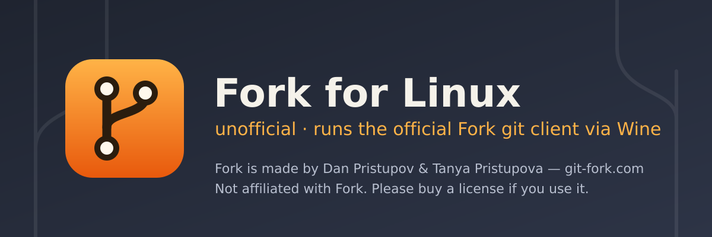

<p align="center">
	<a href="https://github.com/ventura8/Fork-Linux/releases/latest">
		
	</a>
	<a href="https://github.com/ventura8/Fork-Linux/releases">
		
	</a>
	<a href="https://github.com/ventura8/Fork-Linux/actions/workflows/check.yml?query=branch%3Amain">
		
	</a>
	<a href="LICENSE">
		
	</a>
</p>

Run the official **[Fork](https://git-fork.com) git client for Windows** on Linux — installed, launched, integrated and updated for you under Wine, without modifying Fork.

> [!IMPORTANT]
> **Fork for Linux (unofficial)** is a community project. It is **not affiliated with, endorsed by, or supported by** Fork's developers, Dan Pristupov and Tanya Pristupova.
>
> - Fork is **proprietary, paid software**. The evaluation is free; if you keep using it, please **[buy a license](https://git-fork.com/buy)**.
> - This project never redistributes or patches Fork: the official installer is downloaded from `cdn.fork.dev` on your machine and verified.
> - **Report wrapper bugs here**, in [this repository's issues](https://github.com/ventura8/Fork-Linux/issues) — not to Fork support.

## How it works

1. `fork-linux` (Python 3.10+, standard library only) creates a **private Wine prefix** in `~/.local/share/fork-linux/prefix/`. It never touches `~/.wine` or any prefix it did not create.
2. On first run it downloads a **pinned, sha256-verified Wine** build, installs **.NET Framework 4.8** and the core fonts with winetricks, applies the registry tweaks Fork needs, then runs the **official Fork installer** silently.
3. Every launch goes straight to Wine (`fork ~/src/repo` opens the repository). Before each launch, a snapshot of Fork's install lets you **roll back** a bad Fork self-update.
4. Small Windows shims let Fork open your **Linux terminal, file manager and diff tools**. An experimental, opt-in **git bridge** makes Fork run your native `/usr/bin/git`.

## Quick install

Per-user install into `~/.local` (no `sudo`; it asks before installing any missing host libraries with your package manager):

```bash
curl -fsSL https://github.com/ventura8/Fork-Linux/releases/latest/download/install.sh | bash
```

Prefer to read it first? Download, inspect, then run:

```bash
curl -fsSLO https://github.com/ventura8/Fork-Linux/releases/latest/download/install.sh
less install.sh
bash install.sh            # --help lists --system, --setup, --dry-run, --version, ...
```

The installer verifies the release tarball against `SHA256SUMS` and keeps a manifest so `uninstall.sh` removes exactly what it installed.

## Install methods

All channels are **x86_64 only** and never depend on your distribution's `wine` package. The first release is in preparation: channels go live with v0.1.0.

| Channel | Command |
|---|---|
| Ubuntu / Mint (PPA: 22.04, 24.04, 26.04) | `sudo add-apt-repository ppa:ventura8/fork-linux && sudo apt install fork-linux` |
| Debian / Ubuntu `.deb` | Download from [Releases](https://github.com/ventura8/Fork-Linux/releases), then `sudo apt install ./fork-linux_<version>_amd64.deb` |
| Fedora 44 | `sudo dnf install ./fork-linux-<version>-1.fc44.x86_64.rpm` |
| openSUSE Leap 16.0 | `sudo zypper install ./fork-linux-<version>-*.x86_64.rpm` |
| Arch Linux / AUR | `yay -S fork-linux` (or `makepkg -si` with the release `PKGBUILD`) |
| Flatpak | `flatpak install --user ./io.github.ventura8.ForkLinux.flatpak` (uses the `org.winehq.Wine` BaseApp) |
| AppImage | `chmod +x fork-linux-<version>-x86_64.AppImage && ./fork-linux-<version>-x86_64.AppImage --install-desktop` |
| Snap (classic) | `sudo snap install fork-linux --classic` |
| Tarball | `fork-linux-<version>-x86_64.tar.gz` — relocatable; `install.sh --from-tarball` installs it |

## First run

Start **Fork for Linux (unofficial)** from your app menu, or run `fork`. Setup shows Fork's [license agreement](https://git-fork.com/license) and the download list, and asks before it starts. Then it fetches:

| What | From | Size |
|---|---|---|
| Wine 11.0 staging (WoW64) — Kron4ek build, pinned + sha256-verified | GitHub ([Kron4ek/Wine-Builds](https://github.com/Kron4ek/Wine-Builds)) | ~75 MB |
| Winetricks (pinned release) | GitHub ([Winetricks/winetricks](https://github.com/Winetricks/winetricks)) | < 1 MB |
| Microsoft .NET Framework 4.8 and core fonts — installed by winetricks under **Microsoft's license terms** | Microsoft | ~125 MB |
| Fork installer (2.23.2 by default), verified against a pinned sha256 | `https://cdn.fork.dev/win/` | ~76 MB |

Plan for **about 2.5–3 GB of disk** and **10–20 minutes** (less on a fast connection). Setup is resumable: if it fails, the next run continues from the failed step. Headless: `fork-linux setup --accept-fork-eula --no-launch`.

## Usage

- `fork` — start Fork.
- `fork .` or `fork ~/src/myrepo` — open a repository (a path inside a repository opens its root). If Fork is already running, the repository opens in a new tab.
- **Desktop launcher** — "Fork for Linux (unofficial)" in your app menu, with Fork's own icon extracted from your copy.
- **Open in Fork** — a right-click action in Nautilus, Nemo, Caja, Dolphin and Thunar: `fork-linux desktop install --file-managers <list>`.

## CLI

`fork-linux [--json] [--prefix DIR] [--gui | --no-gui] [--offline] [-v | -q] [--allow-root] <command>` — `fork-linux --help` and `man fork-linux` list every option.

| Command | Purpose |
|---|---|
| `setup [--fork-version V \| --latest] [--allow-untested] [--wine managed\|system\|flatpak\|PATH] [--dotnet auto\|dotnet48\|dotnet472] [--accept-fork-eula] [--only STEP \| --from-step STEP] [--force] [--reset] [--no-launch] [--list-steps]` | Idempotent, resumable bootstrap |
| `run [PATH …]`, `open PATH …`, `fork [PATH]` (`[--debug] [--wine-debug CHANNELS] [--x11 \| --wayland] [--no-setup] [--no-hooks]`) | Launch Fork or open repositories |
| `update [--check \| --fork \| --wine] [--fork-version V \| --latest] [--allow-untested]` | Check for and apply Fork / Wine runtime updates |
| `snapshot create [--reason R] \| list \| delete ID \| prune` | Manage snapshots of Fork's install |
| `rollback [ID \| --to-version V] [--with-settings] [--no-pin]` | Restore a snapshot and pin that version |
| `doctor [--fix] [--deep] [--network] [--check ID …]` | 36 health checks with fix hints |
| `config get \| set \| unset \| list \| path \| edit` | Fork for Linux settings (`~/.config/fork-linux/config.ini`) |
| `settings show \| get \| set \| unset \| apply-defaults \| backup \| restore [FILE] \| path` | Fork's own `settings.json` (edited only while Fork is closed) |
| `desktop install [--file-managers LIST] [--no-menu] [--no-icons] [--cli-alias] \| remove \| status` | Menu entry, icon, file-manager actions |
| `ssh sync [--dry-run] [--mode link\|copy] [--no-config] \| status` | Share your SSH keys and config with Fork |
| `git-bridge enable \| disable \| status` | Experimental native-git bridge (opt-in) |
| `logs [--wine \| --fork \| --velopack \| --setup \| --all] [--follow \| --path \| --bundle]` | Show logs or create a redacted bug-report bundle |
| `uninstall [--purge] [--keep-downloads] [--yes]` | Remove integrations; `--purge` also removes the prefix and runtimes |
| `about` / `credits`, `version`, `status` | Credits, version, setup and Fork status |

Exit codes are stable and documented in [AGENTS.md §5](AGENTS.md#5-standard-exit-code-mapping) (for example `10` not set up, `13` integrity check failed, `15` Fork is running).

## Wine providers

| Provider | What it uses |
|---|---|
| `managed` (default) | A pinned Kron4ek Wine 11.0 staging WoW64 build, downloaded and sha256-verified per user. No i386 multiarch needed. |
| `system` | Your distribution's Wine ≥ 9.0. Non-staging builds trigger a warning: git hooks and bash-based features need staging ([Wine bug 55138](https://bugs.winehq.org/show_bug.cgi?id=55138)). |
| `flatpak` | The Wine from the `org.winehq.Wine` BaseApp (Flatpak builds only). |
| custom path | `fork-linux setup --wine /path/to/bin/wine` |

## Compatibility

Baseline: **Ubuntu 26.04**; oldest supported: **Ubuntu 22.04**. CI also covers Ubuntu 24.04, Debian 13, Fedora 44, openSUSE Leap 16.0 and Arch Linux. Results per distribution, desktop and Wine provider are recorded — from real end-to-end runs only — in [docs/COMPATIBILITY.md](docs/COMPATIBILITY.md).

## Troubleshooting

- **Start with `fork-linux doctor`.** It checks the host, Wine, the prefix, Fork and the integrations, and prints a fix for every failure; `fork-linux doctor --fix` applies the safe ones.
- **Logs**: `fork-linux logs` (files in `~/.local/state/fork-linux/logs/`). `fork-linux logs --bundle` creates a redacted archive to attach to an issue. Earlier Fork sessions' `fork.log` files are kept there as `fork-<time>.log`.
- **Repository problems**: `fork-linux repo check` lists what breaks per repository (hooks, symlinks, submodules, remotes given as Linux paths, `core.filemode`); `fork-linux repo fix PATH` sets `core.filemode=false` and marks tracked symlinks `skip-worktree` after asking, and `fork-linux repo undo PATH` reverts exactly that.

What fork-linux connects for you:

- **Open in Shell / the Console button** opens your desktop's terminal in the repository (`fork-linux-terminal`; `$FORK_LINUX_TERMINAL` or `[integration] terminal` picks the program).
- **Show in File Explorer / Open In File Explorer** opens your Linux file manager with the file selected; **Open** on a file uses your Linux default application.
- **File dialogs** (Open repository, Clone) do not accept Linux paths such as `/home/you/src`: type `H:\src` (the `H:` drive is your home) or `Z:\home\you\src`, or browse through `/`.
- New clones go to your Linux home by default, never into the Wine prefix.

Known Wine limitations:

- **Hooks that start other programs are silently skipped** by Fork's bundled git under Wine (its `sh` dies after the first program, and the commit still succeeds). `fork-linux doctor` lists affected repositories; commit there from a terminal, or try the experimental git bridge (`fork-linux git-bridge enable`).
- **Symlinks** look like modified files to Fork (and committing them through Fork's git turns them into plain files); **submodule update / init** does nothing; **Git Bash** exits at once. Use a terminal for these, or the experimental git bridge.
- **Spell checking** does nothing under Wine; keep it disabled.
- **GitHub account sign-in (OAuth) can crash Fork under Wine.** Use a GitHub personal access token instead. Credentials are stored with DPAPI inside the prefix.
- **Wayland**: Fork runs through XWayland by default; Wine's native Wayland driver is opt-in and experimental.
- **License activations**: each new Wine prefix may count as a new machine for your Fork license (3 per license). **Deactivate the license in Fork before `fork-linux uninstall --purge`** or before deleting the prefix.

## Uninstall

```bash
fork-linux uninstall            # remove menu entries, icons and file-manager actions; keep your prefix
fork-linux uninstall --purge    # also delete the prefix, runtimes, snapshots and caches (deactivate your license first)
```

Then remove the program with the tool you installed it with: `curl -fsSL https://github.com/ventura8/Fork-Linux/releases/latest/download/uninstall.sh | bash` (for `install.sh` installs), `sudo apt remove fork-linux`, `sudo dnf remove fork-linux`, `sudo zypper remove fork-linux`, `sudo pacman -R fork-linux`, `flatpak uninstall io.github.ventura8.ForkLinux`, `sudo snap remove fork-linux`, or delete the AppImage. Packages never touch your home directory, and nothing ever touches `~/.wine`.

## Credits & support the developers

<!-- credits:begin -->
**Fork** is made by **Dan Pristupov** and **Tanya Pristupova** — https://git-fork.com. Everything that makes Fork great is their work; this wrapper only makes it start on Linux.

- **Please buy a license:** https://git-fork.com/buy — the evaluation is free; a license ($59.99 at the time of writing) covers one user on up to three machines.
- Release notes: https://git-fork.com/releasenoteswin · License (EULA): https://git-fork.com/license · Twitter: [@git_fork](https://twitter.com/git_fork)
- Fork's issue trackers: [fork-dev/TrackerWin](https://github.com/fork-dev/TrackerWin) (Windows) · [fork-dev/Tracker](https://github.com/fork-dev/Tracker) (Mac and general). support@fork.dev is for licensing questions only.

> Fork for Linux (unofficial) is **NOT affiliated with, endorsed by, or supported by** Fork's developers. Report Linux and wrapper issues to [ventura8/Fork-Linux](https://github.com/ventura8/Fork-Linux/issues), not to Fork support. If a problem also happens on Windows, report it to [fork-dev/TrackerWin](https://github.com/fork-dev/TrackerWin).

**Community prior art:** [pixiekat's Wine guide (§10)](https://github.com/pixiekat/gists/blob/main/install-wine-and-delinea.md), [jasonnicholson/fork-wine-setup](https://github.com/jasonnicholson/fork-wine-setup), [NitroHxC's gists](https://gist.github.com/NitroHxC/ff579d57b15f7ba5dcd1429eac13468f), [fork-dev/Tracker#2033](https://github.com/fork-dev/Tracker/issues/2033) and [#153](https://github.com/fork-dev/Tracker/issues/153), the [WineHQ AppDB](https://appdb.winehq.org/objectManager.php?sClass=version&iId=42350), [dakusan/tortoisewine](https://github.com/dakusan/tortoisewine), [coskunergan/ubuntu_tortoise](https://github.com/coskunergan/ubuntu_tortoise), [andy-5/wslgit](https://github.com/andy-5/wslgit).

**Upstream projects:** [Wine](https://www.winehq.org), [Kron4ek Wine-Builds](https://github.com/Kron4ek/Wine-Builds), [Winetricks](https://github.com/Winetricks/winetricks).

Full credits and third-party licenses: [docs/CREDITS.md](docs/CREDITS.md).
<!-- credits:end -->

## Contributing

Issues and pull requests are welcome — please use the [issue forms](https://github.com/ventura8/Fork-Linux/issues/new/choose) and the [pull request template](.github/pull_request_template.md). Before you start, read [AGENTS.md](AGENTS.md): its hard rules apply to every contributor, human or AI. In short:

- never add Fork binaries, logos, icons or screenshots, and never patch Fork;
- every download is HTTPS and sha256-verified;
- never touch `~/.wine` or a prefix we did not create;
- Python 3.10 standard library only, no linter suppressions, tests for new code.

## AI Assistance

If you are developing or modifying this codebase using an AI coding assistant, start from the canonical rules and skills:

* [AGENTS.md](AGENTS.md) — Workspace guidelines, hard rules, architecture summary, coding standards, CI/Docker matrix rules (shared across tools).
* [docs/INSTRUCTIONS.md](docs/INSTRUCTIONS.md) — Build, install, extend, and debug.
* [docs/architecture/README.md](docs/architecture/README.md) — Component deep dive.
* [`.agents/skills/`](.agents/skills/) — Focused runbooks (`SKILL.md` per workflow).

Thin tool entrypoints (point at `AGENTS.md`, do not fork rules): [CLAUDE.md](CLAUDE.md), [GEMINI.md](GEMINI.md), [`.github/copilot-instructions.md`](.github/copilot-instructions.md), [`.cursor/rules/fork-linux-agents.mdc`](.cursor/rules/fork-linux-agents.mdc). Legacy stubs: [agent.md](agent.md), [skills.md](skills.md).

## License

The code in this repository is released under the [MIT License](LICENSE). **Fork itself is proprietary software** owned by its developers and licensed under [its own terms](https://git-fork.com/license); it is not covered by this license and is never included in this repository or its packages. "Fork" and the Fork logo are trademarks of their respective owners; all other trademarks belong to their respective owners.
